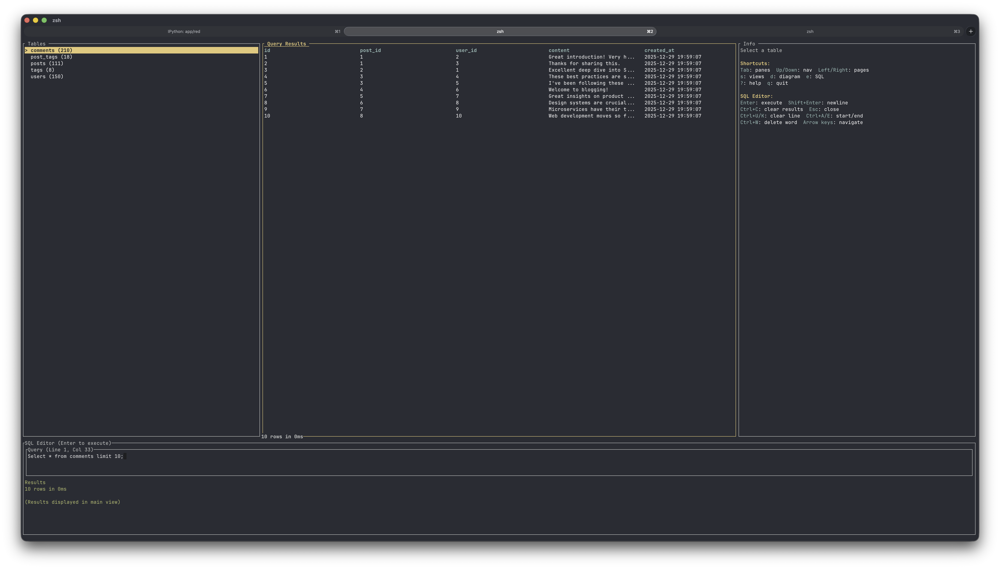

# sqr

A fast, keyboard-first TUI for exploring SQLite databases. Think "htop for SQLite".



## Features

- Fast startup, keyboard-first navigation
- Three-pane layout: Tables | Content | Info
- ER Diagram visualization with relationships
- Row editing (inline or full-screen editor)
- SQL editor with query execution
- Export to CSV/JSON
- Read-only by default (use `--read-write` to enable editing)

## Installation

```bash
cargo install sqr
```

Or build from source:

```bash
git clone https://github.com/Bunchhieng/sqr.git
cd sqr && cargo build --release
```

## Usage

```bash
sqr database.db
sqr database.db --read-write  # Enable editing
sqr database.db --page-size 50  # Custom page size
```

**Export:**
```bash
sqr export --db database.db --table users --format csv --out users.csv
sqr export --db database.db --query "SELECT * FROM users" --format json --out users.json
```

## Keybindings

**Navigation:** `Tab` panes, `↑/↓` navigate, `←/→` pages, `Enter` select/execute/edit

**Views:** `s` cycle modes, `d` ER diagram, `e` SQL editor

**Editing:** `Enter` save, `Shift+Enter` newline, `Ctrl+E` full editor, `Esc` cancel

**SQL Editor:** `Enter` execute, `Shift+Enter` newline, `Ctrl+C` clear results, `Ctrl+U/K` clear line, `Ctrl+A/E` start/end, `Ctrl+W` delete word

**Other:** `/` filter, `?` help, `q` quit

## License

MIT

